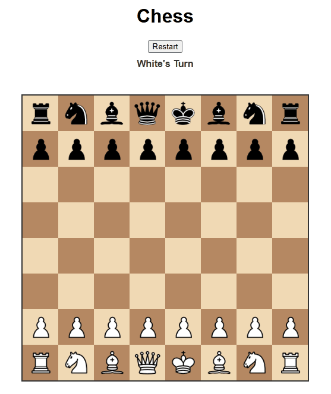

# Flask Chess ♟️

Originally a local Python project with command-line input and output, this application was transformed into a web-based interactive game using Flask. It modernizes the user experience by providing an intuitive web interface where players can click to move pieces, view possible moves, and track game progress in real time. The project is fully containerized with Docker enabling easy deployment. 

It serves as a demonstration of back-end development, web application design, and Docker-based deployment.


## Installation
1. Clone the repo
2. Build and run with Docker Compose
```bash
docker-compose up --build
```
3. Access the game at `http://localhost:5000/`

## Live Demo

[🔗 Play Flask Chess Online](https://flask-chess.onrender.com/static/index.html)  
⚡ **Note:**
This project is deployed on Render's free tier, which may cause:
- Initial cold start delay (~30 seconds)
- Slower API response time due to limited server resources
- Occasional static resource loading failure (e.g., chess piece images)

For the best experience, it is recommended to clone the project and run it locally via Docker. 

## Tech Stack
- Python 3.9
- Flask
- HTML/CSS/JS
- Docker